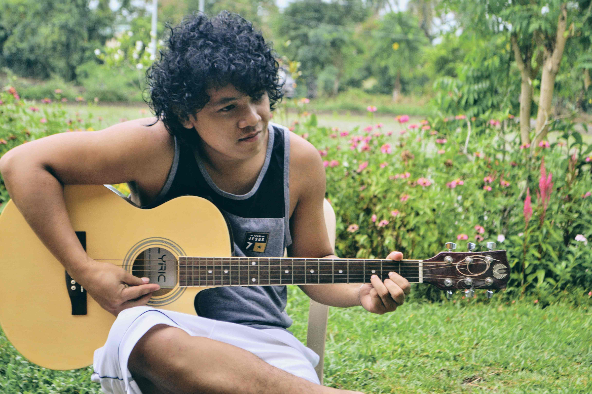

    

        <strong>Jansen</strong> 
        Soft hearted, clever, student, nature-lover. 
        Son of God. 
        Who love music, poem, learning technologies and taking risks. 
        Loves to teach the willing. 
        Who feared world wars, and feared God. 
        Who thrive to master the art of programming. 
        Who wants to travel the world for adventure and enjoy life. 
        Born in Camarines Sur and living in Muntinlupa City.	 
        <strong>Goyena</strong> 
    

    

        

            

                
            

            

                
“Photography is a way of feeling, of touching, of loving. What you have caught on film is captured forever… It remembers little things, long after you have forgotten everything." - Aaron Siskind

            

        

    

    

        

            

                

                    
                

                

                    
People call me Jansen and I love hearing them calling me by my name. during my free time I usually read articles related to java, microservices,design patterns and lately I got interest in photography and blogging

                

            

        

    

    

    <h3>Influencer . Blogger . Photographer . Teacher</h3>
    <h4>WANNABE</h4>

    

        <h4>1 Cor 9:24-25</h4>
        

            24 Do you not know that in a race all the runners run, but only one gets the prize? Run in such a way as to get the prize. 25 Everyone who competes in the games goes into strict training. They do it to get a crown that will not last, but we do it to get a crown that will last forever.
        

    

        

            

                

                    
A love that seeks nothing in return..... Shigatsu-wa-Kimi-no-Uso Episode 16

                

            

        

